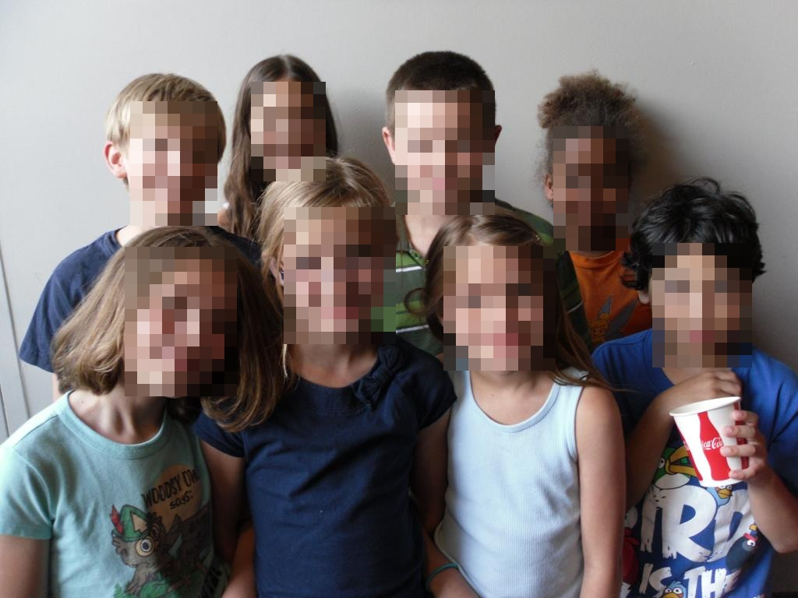
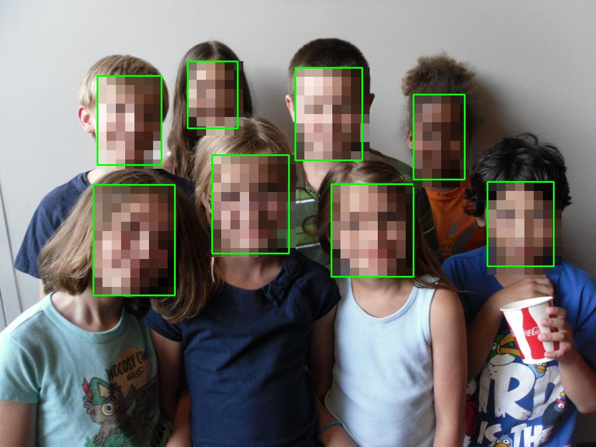

# Automatic Face Mosaic

## Mosaic faces in images

This project will help you to automatically mosaic faces present in the picture from a given directory.

## Requirements

- python >= 3.5
- opencv >= 4.0  &emsp;&emsp; *Because we only tested it on opencv 4.2*
- numpy

## Face Detector
The face detrector in this project uses [Ultra-Light-Fast-Generic-Face-Detector-1MB](https://github.com/Linzaer/Ultra-Light-Fast-Generic-Face-Detector-1MB).

> *Note: each one of the detector has an associated threshold. The thresholds filter the detectors' output, since each network yields a level of confidence for each prediction.* 

*You can change this `threshold` in main.py*

## Mosaic

In this project, the method of masic is completed by using the `average value of each grid`, i.e.:

$${value = \frac{1}{W * H}\sum_{i=0}^W\sum_{j=0}^Hgrid(i,j)}$$

## Examples
### Mutiple faces in ias below
| | |
|:-------------------------:|:-------------------------:|
| Input image| Output Image|

_Input image source: in [Provide MNN C++ inference code & upload MNN FP32 and INT8 models.](https://github.com/Linzaer/Ultra-Light-Fast-Generic-Face-Detector-1MB/tree/master/MNN/imgs)_

if you want to show the face location boxes as below, just modified
```python
args.show_boxes = True
```

| | |
|:-------------------------:|:-------------------------:|
| Input image| Output Image|

_Input image source: in [Provide MNN C++ inference code & upload MNN FP32 and INT8 models.](https://github.com/Linzaer/Ultra-Light-Fast-Generic-Face-Detector-1MB/tree/master/MNN/imgs)_


## Usage
1. Put your images into `imgs` folder
2. Put [version-RFB-320_simplified.onnx](https://github.com/Linzaer/Ultra-Light-Fast-Generic-Face-Detector-1MB/raw/master/models/onnx/version-RFB-320_simplified.onnx) into `facedetect` folder
2. Run project

```python
python main.py --input_folder='./imgs' --results_path='./results'
                --threshold=0.7 --grad_size = 16
```

---
## Reference

[1MB lightweight face detection model (1MB轻量级人脸检测模型)](https://github.com/Linzaer/Ultra-Light-Fast-Generic-Face-Detector-1MB)